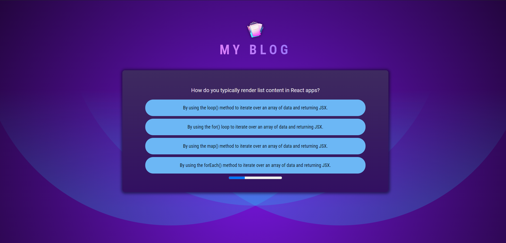
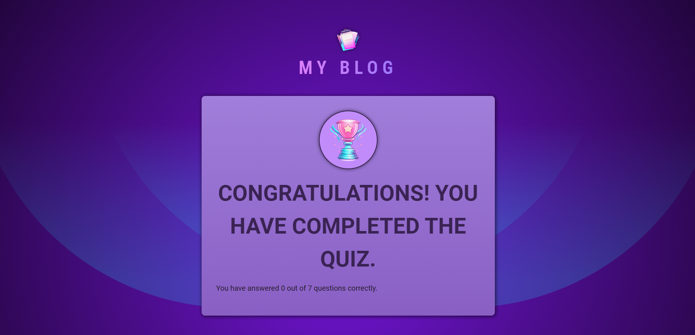

# React Quiz App

## Description

This is a React-based quiz application created as part of the Maxmillian Udemy "The Complete Guide" course. The app allows users to answer multiple-choice questions and provides feedback on their performance. It demonstrates the use of React for building interactive and stateful applications.

## Features

- **Dynamic Question Loading:** Load quiz questions from a JSON file or API.
- **User Feedback:** Provide instant feedback on answers.
- **Score Tracking:** Keep track of the user's score throughout the quiz.

## Getting Started

### Prerequisites

- Node.js and npm installed on your machine.

### Installation

1. Clone the repository:

   ```bash
   git clone https://github.com/yourusername/react-quiz-app.git

   ```

2. Navigate to the project directory:

   ```bash
   cd react-quiz-app

   ```

3. Install dependencies:
   ```bash
   npm install
   ```

### Running the App

1. Start the development server:

   ```bash

   npm run dev
   ```

2. Open your browser and go to http://localhost:3000.

### Screenshots



